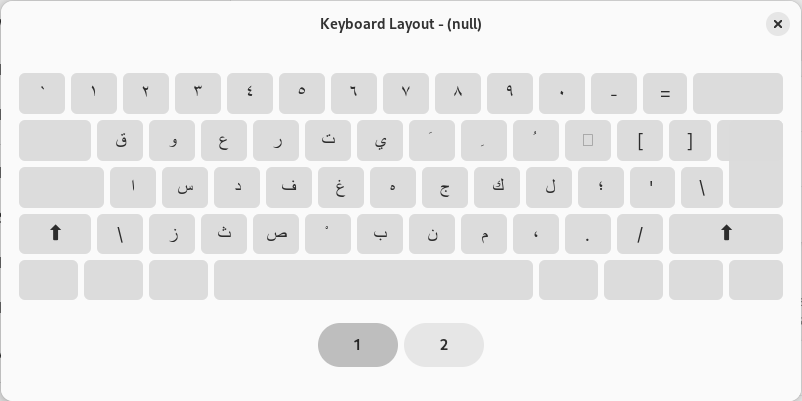
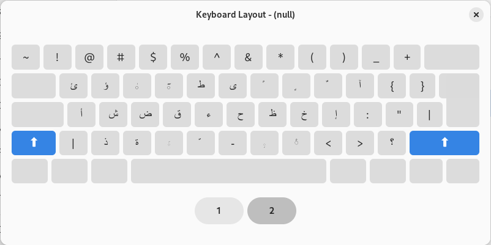

# phonetic-arabic-linux

Arabic phonetic keyboard configuration gnome

## Usage 

`~/ git clone https://github.com/sarimaleem/phonetic-arabic-linux`

`mv /usr/share/X11/xkb/symbols/ara ara_backup`

`mv /usr/share/X11/xkb/symbols/ara /usr/share/X11/xkb/symbols/ara_backup`

`cp ~/phonetic-arabic-linux/arph /usr/share/X11/xkb/symbols/ara`

## Pictures

